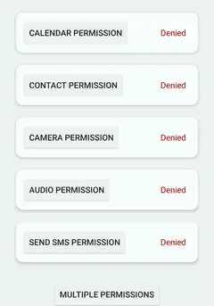

# ExcuseMe
Because we don't need to be rude for asking permissions

[](https://circleci.com/gh/AraujoJordan/ExcuseMe)
[](https://android-arsenal.com/details/1/8122)
[](https://jitpack.io/p/AraujoJordan/ExcuseMe)
[](https://jitpack.io/AraujoJordan/ExcuseMe/)
[](https://github.com/AraujoJordan/ExcuseMe/LICENSE)
[](http://hits.dwyl.com/AraujoJordan/ExcuseMe)

ExcuseMe is an Android library that provides an one-line implementation for android permissions made with Kotlin.

```kotlin
val granted : Boolean = ExcuseMe.couldYouGive(this).permissionFor(android.Manifest.permission.CAMERA)
```


## 🚀 Why you should use ExcuseMe?

1. Better performance with Kotlin Coroutines
   * Coroutines uses less memory have better performance than threads for small async/ui thread changes.
2. One-line permission request
   * ExcuseMe can be used with Kotlin Suspending functions that gives a better syntax and better code readability
3. No more interface listeners to implement
   * You don't need to implement callbacks interfaces that it just add boilerplate code to maintain
4. It can be used with lambda callbacks
   * If you don't know how to implement suspend functions, ExcuseMe could be used with Kotlin lambda callbacks
5. Handling uncaught permissions automatically
   * You can use this one line method to ask permissions automatically. No more SecurityException because of permissions!
6. Polite way to ask for requests
   * Because we don't need to be rude for asking permissions

## 📖 Usage

ExcuseMe is easier way to implement Permissions in Android. But you still have to add the permission in the AndroidManifest.xml file.


```xml
<?xml version="1.0" encoding="utf-8"?>
<manifest xmlns:android="http://schemas.android.com/apk/res/android"
    package="your.package.name">

    <!-- Add your permission here-->
    <uses-permission android:name="android.permission.CAMERA" />

    <application
        android:icon="@mipmap/ic_launcher"
        android:roundIcon="@mipmap/ic_launcher_round"
        ...
    </application>
</manifest>
```

You can find the complete list of permissions on [this documentation](https://developer.android.com/reference/android/Manifest.permission "Manifest Permissions").

After that, you can use on of the three implementations bellow to add the permission properly:

1. [The Simple one line Usage](#onelineusage)
2. [Auto Permission One line Handling](#automagically)
3. [Kotlin Lambda Callback Usage](#lambdacallback)


### <a name='onelineusage'></a>1. Simple one line Usage

This implementation uses [suspend functions](https://kotlinlang.org/docs/reference/coroutines/composing-suspending-functions.html#composing-suspending-functions "Composing Suspending Functions") to make it easier the permission request. It will listen async the permission dialog response, so it won't pause the UI.

```kotlin
suspend fun cameraUsage() {
    if(ExcuseMe.couldYouGive(this).permissionFor(android.Manifest.permission.CAMERA) {
        //Do your camera stuffs
    }
}
```
And that's it. No more override the onRequestPermissionsResult() implementation on your activity, no more class-scope variables to keep what you want for the permission result, and no more others boilerplate to maintain in your code.

If you want to learn more of how to use Suspend functions, I recommend [this video](https://www.youtube.com/watch?v=IQf-vtIC-Uc "Android Developers") to understand it.
### <a name='automagically'></a>2. Auto Permission Handling

This one line implementation listen and ask the permissions automagically for you.

```kotlin
override fun onCreate(savedInstanceState: Bundle?) {
    super.onCreate(savedInstanceState)
    setContentView(R.layout.activity_main)

    ExcuseMe.couldYouHandlePermissionsForMe(this) { accept ->  if(accept) openCamera() }

    openCamera()
}
```

### <a name='lambdacallback'></a>3. Kotlin Lambda Callback Usage

This implementation uses [trailing lambdas callbacks](https://kotlinlang.org/docs/reference/lambdas.html#passing-a-lambda-to-the-last-parameter "Passing trailing lambdas"), so it will be natural like as an OnClickListener implementation.

```kotlin
override fun onCreate(savedInstanceState: Bundle?) {
    super.onCreate(savedInstanceState)
    setContentView(R.layout.activity_main)

    ExcuseMe.couldYouGive(this).permissionFor(
        android.Manifest.permission.CAMERA,
        ) {
        if(it.granted.contains(android.Manifest.permission.CAMERA)) {
            //Do your camera stuffs
        }
    }
}
```

This method doesn't need to use a suspend function, but it uses callback.

## 📦 Installation

#### Step 1. Add the JitPack repository to your project build file

+ build.gradle (Project: YourProjectName)
```gradle
allprojects {
	repositories {
		maven { url 'https://jitpack.io' }
	}
}
```

#### Step 2. Add the dependency to your app build file

+ build.gradle (Module: app) [](https://jitpack.io/AraujoJordan/ExcuseMe/)
```gradle
dependencies {
	implementation 'com.github.AraujoJordan:ExcuseMe:x.x.x'
}
```

And that's it!

## 🌟 Extras

ExcuseMe is in-built with simple functions that helps user with permissions related problems.

## Requesting multiple permissions

You can also run multiple permissions request in the same function and syntax.

```kotlin
suspend fun lotOfPermissions() {
	val res = ExcuseMe.couldYouGive(this).permissionFor(android.Manifest.permission.CAMERA, android.Manifest.permission.RECORD_AUDIO, android.Manifest.permission.WRITE_EXTERNAL_STORAGE)
}
```


### Checking granted permissions

You can use this method to check one or multiple permissions in one simple function call

```kotlin
//single permission
val bool = ExcuseMe.doWeHavePermissionFor(this, android.Manifest.permission.CAMERA)

//You can also ask if the system have multiple permissions (Can be more than two)
val bool = ExcuseMe.doWeHavePermissionFor(this,
    android.Manifest.permission.CAMERA,
    android.Manifest.permission.READ_CONTACTS,
    ...
    )
```

## Explain why need the permission

You can explain why you need that permission. This will reduce the chances of deny and increase your
app [Android Vitals Score](https://developer.android.com/distribute/best-practices/develop/android-vitals.html "The percentage of daily permission sessions during which users deny permissions or select Never ask again. Permission denials may indicate that people are unclear why a permission is being requested or view the request as unnecessary or unreasonable."). Apps whose metrics are higher have greater promotability, which raises their ranking in Google Play Store searches

The gently() methods will explain why the app will ask the required permission

```kotlin
 ExcuseMe.couldYouGive(this).gently(
        "Permission Request",
        "To easily connect with family and friends, allow the app access to your contacts"
    ).permissionFor(permission.READ_CONTACTS)
```

This can also be used with a custom implementation (without using the default dialog we provide)

```kotlin
ExcuseMe.couldYouGive(this).gently { result ->
        val dialog = AlertDialog.Builder(this@ExampleActivity)
        dialog.setTitle("Ask Permissions")
        dialog.setMessage("To scan your document faster, allow the app access the camera")
        dialog.setNegativeButton("Not now") { _, _ -> result(false) }
        dialog.setPositiveButton("Continue") { _, _ -> result(true) }
        dialog.setOnCancelListener { result(false) } //important
        dialog.show()
    }.permissionFor(permission.CAMERA)
```

## Resolve when the user denies a permission

You can have a fallback when the user denies a permission, insisting and explaining why the
required permission is necessary to continue, but always showing a "Not now" button to not block
the user completely. It can also be a custom implementation, just like the gently() method.

The please() method will insist and show a proper explanation when the user denies a permission,
asking if the user want to try again. It's also can redirect the user to the app settings, in the case
of the user react to put not show the permission request again.

```kotlin
ExcuseMe.couldYouGive(this).please(
    explainAgainTitle = "Permission is necessary",
    explainAgainExplanation = "The app need this permission to send the automatic SMS",
    showSettingsTitle = "Set permission in Settings",
    showSettingsExplanation = "The app will open the settings to change the permission from there"
).permissionFor(permission.SEND_SMS)
```

This can also be used with a custom implementation (without using the default dialog we provide)

```kotlin
ExcuseMe.couldYouGive(this).please { type, result ->
    when (type) {
        DialogType.EXPLAIN_AGAIN -> { /** do you things**/ }
        DialogType.SHOW_SETTINGS -> { /** do you things**/ }
    }
    result.invoke(true) //continue
    // or
    result.invoke(false) //continue

}.permissionFor(permission.SEND_SMS)
```

## 📄 License

```
MIT License

Copyright (c) 2020 Jordan L. A. Junior

Permission is hereby granted, free of charge, to any person obtaining a copy
of this software and associated documentation files (the "Software"), to deal
in the Software without restriction, including without limitation the rights
to use, copy, modify, merge, publish, distribute, sublicense, and/or sell
copies of the Software, and to permit persons to whom the Software is
furnished to do so, subject to the following conditions:

The above copyright notice and this permission notice shall be included in all
copies or substantial portions of the Software.

THE SOFTWARE IS PROVIDED "AS IS", WITHOUT WARRANTY OF ANY KIND, EXPRESS OR
IMPLIED, INCLUDING BUT NOT LIMITED TO THE WARRANTIES OF MERCHANTABILITY,
FITNESS FOR A PARTICULAR PURPOSE AND NONINFRINGEMENT. IN NO EVENT SHALL THE
AUTHORS OR COPYRIGHT HOLDERS BE LIABLE FOR ANY CLAIM, DAMAGES OR OTHER
LIABILITY, WHETHER IN AN ACTION OF CONTRACT, TORT OR OTHERWISE, ARISING FROM,
OUT OF OR IN CONNECTION WITH THE SOFTWARE OR THE USE OR OTHER DEALINGS IN THE
SOFTWARE.
```

